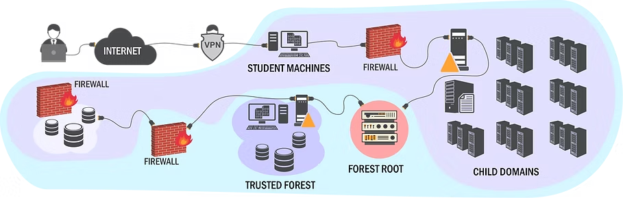

# CRTP Notes

<figure><figcaption></figcaption></figure>

## Certified Red Team Professional Lab Objective:

L'importanza di Active Directory in un'azienda non può essere sottolineata abbastanza. Utilizzato da oltre il 90% delle aziende Fortune 1000, l'onnipresente AD è il punto focale per gli avversari. Tuttavia, quando si tratta della sicurezza di AD, esiste un grande divario di conoscenze che i professionisti della sicurezza e gli amministratori faticano a colmare. Nel corso degli anni, abbiamo formato numerosi professionisti con corsi di formazione pratici sulla sicurezza di AD e abbiamo sempre riscontrato una carenza di materiale di qualità e, in particolare, di laboratori pratici in cui poter esercitarsi con attacchi AD in un ambiente controllato.

Il laboratorio “Attacking and Defending Active Directory (Certified Red Team Professional)” è progettato per fornire ai professionisti della sicurezza una piattaforma per comprendere, analizzare e mettere in pratica minacce e attacchi in un moderno ambiente Active Directory. Il laboratorio è adatto ai principianti e include un corso video completo e un manuale di laboratorio. Il corso e il laboratorio si basano sulla nostra pluriennale esperienza nella creazione e nella violazione di ambienti Windows e AD e nella formazione di professionisti della sicurezza.\
​\
Il laboratorio è strettamente integrato con il corso ed è progettato come laboratorio pratico piuttosto che come laboratorio di sfida. Trattiamo argomenti quali enumerazione AD, mappatura dei trust, escalation dei privilegi di dominio, persistenza di dominio, attacchi basati su Kerberos (Golden ticket, Silver ticket e altro), problemi ACL, trust SQL server, difese e bypass delle difese.​

\

### Incluso nel corso

* Accesso a un ambiente di laboratorio (uno/due/tre mesi) con macchine Server 2022 aggiornate. È possibile accedere al laboratorio tramite browser web o VPN.
* Una macchina virtuale pronta all'uso nel cloud che dispone di tutti gli strumenti e Sliver C2 preinstallati.
* Accesso illimitato a tutto il materiale didattico (compresi gli aggiornamenti del corso).\
  Oltre 14 ore di video corso con sottotitoli in inglese.
* Slide del corso.
* Due manuali di laboratorio. Uno per risolvere il laboratorio utilizzando strumenti autonomi. Il secondo per risolvere i laboratori utilizzando C2.
* Video tutorial.
* Un tentativo di esame per la certificazione Certified Red Team Professional (CRTP).
*   Assistenza tramite e-mail e Discord.

### **Cosa imparerai?**

Il laboratorio Attacking and Defending Active Directory ti consente di:

* Esercitarti con vari attacchi in un ambiente Windows realistico e completamente aggiornato con macchine Server 2022 e SQL Server 2017.
* Utilizzare più domini e foreste per comprendere e mettere in pratica gli attacchi cross trust.
* Apprendere e comprendere i concetti degli attacchi più noti a Windows e Active Directory.
* Imparare a utilizzare Windows come piattaforma di attacco e a sfruttare le funzionalità affidabili del sistema operativo come .NET, PowerShell e altre per gli attacchi.
* Bypassare le difese come Windows Defender, Microsoft Defender for Endpoint (MDE) e Microsoft Defender for Identity (MDI).

​

* Basic understanding of Active Directory.
* Ability to use command line tools on Windows.

​

\
